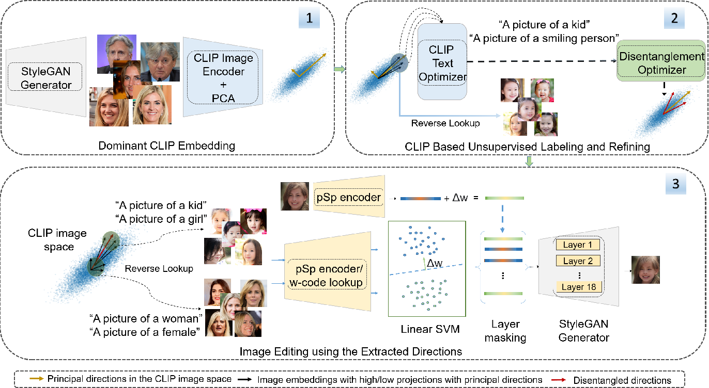

# CLIP2StyleGAN: Unsupervised Extraction of StyleGAN Edit Directions
## SIGGRAPH 2022



**Figure:** *Unsupervided Framework CLIP2StyleGAN method*

The success of StyleGAN has enabled unprecedented semantic editing capabilities, on both synthesized and real images. However, such editing operations are either trained with semantic supervision or described using human guidance. In another development, the CLIP architecture has been trained with internet-scale image and text pairings and has been shown to be useful in several zero-shot learning settings. In this work, we investigate how to effectively link the pretrained latent spaces of StyleGAN and CLIP, which in turn allows us to automatically extract semantically labeled edit directions from StyleGAN, finding and naming meaningful edit operations without any additional human guidance. Technically, we propose two novel building blocks; one for finding interesting CLIP directions and one for labeling arbitrary directions in CLIP latent space. The setup does not assume any pre-determined labels and hence we do not require any additional supervised text/attributes to build the editing framework. We evaluate the effectiveness of the proposed method and demonstrate that extraction of disentangled labeled StyleGAN edit directions is indeed possible, and reveals interesting and non-trivial edit directions.
> **CLIP2StyleGAN: Unsupervised Extraction of StyleGAN Edit Directions** <br>
>  Rameen Abdal Peihao Zhu, John Femiani, Niloy Mitra, Peter Wonka <br>
>  KAUST, Miami University, UCL and Adobe Research <br>


[[Paper](https://arxiv.org/abs/2112.05219)]


## Installation

Clone this repo.
```bash
git clone https://github.com/RameenAbdal/CLIP2StyleGAN.git
cd CLIP2StyleGAN/
```

Install dependencies.
```bash
conda create --n CLIP2StyleGAN python=3.7
conda actitivate CLIP2StyleGAN
conda install --yes -c pytorch pytorch=1.7.1 torchvision cudatoolkit=11.0
pip install ftfy regex tqdm natsort
```

Download the StyleGAN2 models, test data and encoded features [here]().
## Dominant CLIP Embedding
### Computing the PCA directions

Compute and save the PCA directions and the projections in a folder.

``` bash
python compute_pca.py image_path [path to the Dataset (Real/Sampled)] --extracted_features_path [path to the CLIP Image encoder features]
```

## CLIP based unsupervised labeling and refining
### Predicting the labels

Compute the labels given an image folder. For testing, two folders representing first two principal components can be downloaded [here](). 

``` bash
python text_optimize.py --path [path to the image folder]
```
### Disentangling the directions

Disentangle the entangled directions. For testing, two folders representing entangled edits mentioned in the paper can be downloaded [here]().

``` bash
python optimize_dir.py --path_image_data [path to the image folder] --path_features [path to the CLIP Image encoder features] --pca_axis [index of the principal axis]
```

## Edits

Perform the edits on Faces and Cars. StyleGAN2 pretrained models can be downloaded [here]().

``` bash
cd edits
python edit_faces.py --edit_type ['to_male', 'to_female', 'glasses','smile', 'kids', 'beard'] --ckpt [path to checkpoint]
python edit_cars.py --edit_tyle ['scrap_to_car', 'red_car', 'capri', 'race_car', 'blazer'] --ckpt [path to checkpoint]
```

## Comparisons

Download the data (here)[] to compute the CLIP edit scores (compared with GANSpace) and Disentanglement results.

``` bash
python test_clip_scores.py
python test_disentanglement.py
```


## Citation

```
@article{DBLP:journals/corr/abs-2112-05219,
  author    = {Rameen Abdal and
               Peihao Zhu and
               John Femiani and
               Niloy J. Mitra and
               Peter Wonka},
  title     = {CLIP2StyleGAN: Unsupervised Extraction of StyleGAN Edit Directions},
  journal   = {CoRR},
  volume    = {abs/2112.05219},
  year      = {2021},
  url       = {https://arxiv.org/abs/2112.05219},
  eprinttype = {arXiv},
  eprint    = {2112.05219},
  timestamp = {Wed, 19 Jan 2022 09:30:45 +0100},
  biburl    = {https://dblp.org/rec/journals/corr/abs-2112-05219.bib},
  bibsource = {dblp computer science bibliography, https://dblp.org}
}
```


## Acknowledgments
The CLIP and StyleGAN2 codes are taken from [rosinality/stylegan2-pytorch](https://github.com/rosinality/stylegan2-pytorch) and [openai/CLIP](https://github.com/openai/CLIP). This work was supported by Adobe Research and KAUST Office of Sponsored Research (OSR).
